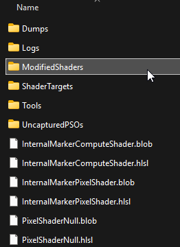
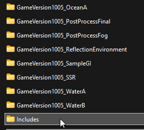
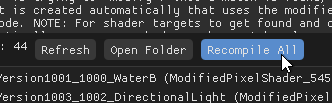

# Configuration Guide

*NOTE: This was written at the release of 2.0, with newer updates this might become more out of date but the general principles are the same.*

With the release of 2.0 it comes with a whole suite of new shaders and features that drastically improve the lighting quality of the game! **However...**

**Some of the features and effects that are featured in screenshots or videos that you might have seen are disabled by default.** This is done for various reasons, the main one being performance. Some of these effects are still experimental and are quite heavy at the moment, I have done my best to optimize but to go further will require further updates in the future to make them much lighter to run. In addition some of them may have some visual problems. For instance the SSGI can add a lot of noise to the final image, or the Auto Exposure can flicker quite a bit.

With that said, even in my sessions I find most of the issues managable and performance on my system *(RTX 3080)* at native 1080p is acceptable. If you want the full visual splendor I will guide you on where to enable the features!

<p float="left">
    
    
    
    
</p>

The raw .hlsl shader source code files are located in ```(game directory)/ShaderInjector/ModifiedShaders```. 

# Maximum Visual Quality Configuration

By default as of 2.0 SSGI and it's AO counterpart along with auto exposure are disabled. To match the visual fedlity as seen in promotional screenshots and videos heres how to enable them.

### SSGI / AO

Find the following file....

```
~FINAL FANTASY VII REBIRTH\End\Binaries\Win64\ShaderInjector\ModifiedShaders\Includes\ComputeShaderPass_ReflectionEnvironment.hlsl
```

Open this file in a text/code editor and you'll want to find the following fields...

```GLSL
//#define SSGI_AMBIENT_OCCLUSION

//#define SSGI_BOUNCE_LIGHT
```

To enable them, just simply get rid of the two forward slashes on each of them like so...

```GLSL
#define SSGI_AMBIENT_OCCLUSION

#define SSGI_BOUNCE_LIGHT
```

Save changes to the file and tab or open the game back up, and click ```Recompile All```.



You should see immediate visual changes after compilation completes, with more visible ambient occlusion and local bounce light!

### Auto Exposure

Find the following file....

```
~FINAL FANTASY VII REBIRTH\End\Binaries\Win64\ShaderInjector\ModifiedShaders\Includes\PixelShaderPass_PostProcessFinal.hlsl
```

Open this file in a text/code editor and you'll want to find the following fields...

```GLSL
//#define AUTO_EXPOSURE
```

To enable them, just simply get rid of the two forward slashes on each of them like so...

```GLSL
#define AUTO_EXPOSURE
```

Save changes to the file and tab or open the game back up, and click ```Recompile All```.


You should see immediate visual changes after compilation completes, with more visible ambient occlusion and local bounce light!