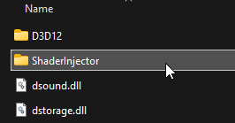
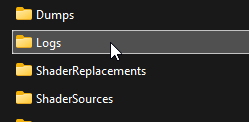
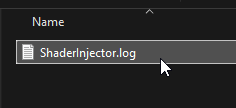

# How to report an issue

This is a document to help give you an idea on how to provide a good issue report if you want to increase the chances of your issue getting resolved successfuly. **The first most important and obvious thing is, the more information you provide the better.**

# ShaderInjector Logs

First important thing to cover is that Shader Injector writes to it's own log file within the game directory in the ```ShaderInjector/Logs/ShaderInjector.log```

<p float="left">
    
    
    
</p>

**Now a current limitation of the injector that I will resolve soon is that on new game launches or reboots, the log file gets cleared.** This is to avoid having a giant log file that gets written to over and over *(this will be resolved soon by keeping a copy of the previous log, and renaming the other log to current)*. But if you crash, likely important details are written into the log file but upon a fresh new boot that you do those details will get lost. Oversight I know, but keep that in mind *(again will be resolved soon)*.

## Issue Report

#### What not to do...

```Help, when I put shader injector into game it doesn't turn on.```

This is not helpful, first off how did you install the shader injector? Did you follow the installation guide closely? What do you mean by the injector doesn't turn on, is there no menu being drawn? There is also no log file given so I can't discern at all what happened.

Good issue reports provide very descriptive details about the actions you took, screenshots, and even better if you provide the log file generated in ```ShaderInjector/Logs/ShaderInjector.log```. Details also about your system specs, and game version are welcome as well.

**The more information I have to work with about your issue, the better chances the issue can get resolved.**