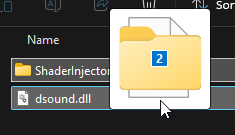
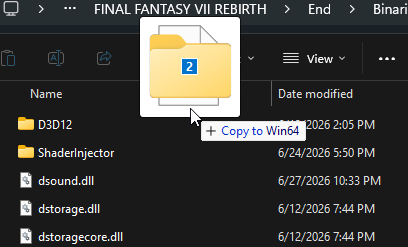
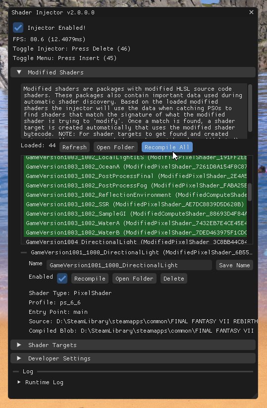

# Update Guide

For existing users who already have the mod installed and want to learn how to update.

**NOTE: For the most part you do not need to rebuild the game shader cache, unless if a new shader injector update intorduces a brand new modified shader. You do not need to delete your previous Shader Targets and can keep them from before.**

Updating is simple, simply drag the contents of the new zip file to the game directory again and replace files *(You will not lose your shader targets)*.

<p float="left">
    
    
</p>

When you boot into the game the you will need to recompile the modified shaders. Just pop up the modified shaders menu and click ```Recompile All```. This will ensure that you are using the up to date compiled shader blobs.



And your done!